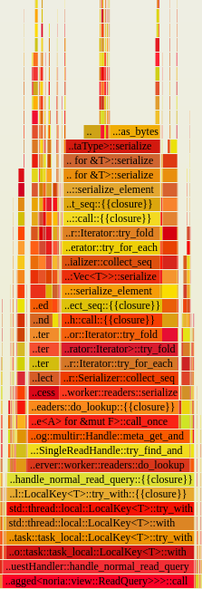

# Benchmarking your code

## Macrobenchmarks

`//benchmarks` let you run macro-benchmarks for ReadySet performance. These include:
  * Executing any arbitrary query at a specific queries-per-second with a specific access pattern.
  * Comparing ReadySet cache hit and cache miss performance for a query.
  * Performing many migrations against the leader.
  * Churning connections.

Benchmarks are all executed as subcommands on the `benchmarks` binary.
The complete set of benchmarks can be seen with `cargo run --bin benchmarks -- --help`.

### Specifying a ReadySet deployment

Benchmarks are run against any deployment that is compatible with MySQL,
for ReadySet that is done by running a MySQL adapter. A deployment is
specified by the `target` and `setup` MySQL connection strings.

These can be specified in several ways:
 * Through the `--target-conn-str` and `--setup-conn-str` in the format,
   `mysql://<username>:<pass>@<hostname>:<port>`. This requires that a
 * By passing a YAML file of deployment parameters, `--deployment
   <path_to_yaml>`. See `//benchmarks/src/yaml/deployments` for
   example deployment files, `local.yaml` may be used for the default
   local ReadySet dev deployment.
 * By specifying `--local`. This runs a noria-server and noria-mysql
   adapter in the benchmarking process. This does not include an
   upstream database and some benchmarks may not work.
 * By specifying `--local-with-mysql mysql://<username>:<pass>@<hostname>:<port>`.
   This runs a noria-server and noria-mysql adapter in the benchmarking
   process with an external MySQL deployment as upstream.

> `--target-conn-str`, `--setup-conn-str` and the YAML file require that
> a deployment that accepts MySQL queries exists at the addresses the 
> target and setup connection strings refer to. For a ReadySet
> deployment this typically means that the upstream MySQL database lives
> at `--setup-conn-str`, a noria-mysql instance can be accessed via
> `--target-conn-str`, and atleast one noria-server instance is running.
> See [Running ReadySet](./running-readyset.md) for more information on
> how to run a local ReadySet deployment.

### Specifying a benchmark to execute
There are several ways to specify the benchmark to be execute:
 * Through using a subcommand and its arguments. `cargo run --bin
   benchmarks -- <deployment parameters> <benchmark> <benchmark args>`
 * By passing a YAML file of benchmark parameters, `--benchmark
   <path_to_yaml>`. See `//benchmarks/src/yaml/benchmarks` for
   example benchmark files. 

### Additional Arguments 
 * `--skip-setup`: Run a benhmark without performing setup. Setup will fail if the MySQL database
                   already includes any of the tables.
 * `--iterations <N>`: Run a benchmark N times and calculate aggregates over the benchmark results.
                       Not supported by all benchmarks.

<!-- TODO(justin): Add more useful examples -->
### Example commands
```
# From the root of the ReadySet repo.
cargo run --bin benchmarks -- --iterations 10 --benchmark benchmarks/src/yaml/benchmarks/read_benchmark_irl_small.yaml \
    --deployment benchmarks/src/yaml/deployments/local.yaml
```

### Writing new benchmarks specifications
Each benchmark may specify a unique set of parameters. Run `cargo run --bin benchmarks -- <benchmark> --help`
for the set of benchmark parameters.

> <b>Annotations</b>
>
> Annotations may be written for database schemas and queries to configure how to generate data,
> and how to generate queries in the benchmark, respectively. See:
>  * [`DistributionAnnotation`][] docs for the complete annotation spec format.
>  * `//benchmarks/src/data/irl` for examples on how to annotate schemas and query specs.

Executing any benchmark outputs a benchmark specification at the start of the run that can be copied to
a file. The argument `--only-to-spec <file>` may be used to write the benchmark spec to a file instead
of executing it.

[`DistributionAnnotation`]: http://docs/rustdoc/query_generator/struct.DistributionAnnotation.html

### Data Generation

To perform data generation separate from a benchmark use the `data_generator` binary.

Sample usage:
```
cargo run --bin data_generator -- --schema benchmarks/src/data/irl/irl_db_small.sql
```

## Flamegraph

Flamegraphs visualize stack traces of profiles software. They visualize
the output of a sampling profiler - CPU, memory, disk utilization. They
can be used to identify areas for performance improvement in our code,
for example, providing an answer to the question: "where is most of my
CPU time spent"?

### Interpreting a flamegraph
Flamegraphs show all of the call stacks measured, widened to the
proportion of the stack samples that contained them. 
    
  - **x-axis**: The x-axis in a flamegraph represent the proportion of
    collected samples aggregated by span. A wider bar indicates more
    collected samples, it does *not* show the passage of time.
  - **y-axis**: The y-axis in a flamegraph indicates the stack depth of
    a specific span. Spans are grouped by their originiting span.



This is a subset of a flamegraph on `noria-server`, showing how a single
read query is handled. We can see that the majority of the time is
performed in serialization.

### Collecting a CPU flamegraph with `cargo-flamegraph`.

[`cargo flamegraph`](https://github.com/flamegraph-rs/flamegraph) can be
used  to easily profile our system. It generates a flamegraph as an
`svg`. 

> It relies on `perf` on linux, and `dtrace` otherwise to profile our 
> code. The respective performance tracing tool must be installed on
> your machine.

When using flamegraph is it useful to:
  * Increease the user stack dump size to 64KB from 8KB.
  * Add a minute delay before perf starts to remove start overhead from
    the graph.
  * Only sample for a small number of seconds when the server is under
    load.
  * If using `perf`, prefer version 5.16 and up.

Sample usage:
```
cargo install flamegraph

# With perf 5.16 and up.
cargo flamegraph -c "record --call-graph dwarf,65528 -g -D 60000" --bin noria-server

# Without perf 5.16 and up.
cargo flamegraph --no-inline --bin noria-server
```

See [flamegraph docs](https://github.com/flamegraph-rs/flamegraph) for 
more information on usage.

> Perf 5.16 is only available on our EC2 image by building from source.
> ```
> git clone --depth 1 --branch v5.16 git://git.kernel.org/pub/scm/linux/kernel/git/torvalds/linux.git
> sudo apt-get install build-essential flex bison libelf-dev libunwind-dev libdw-dev python-dev libperl-dev binutils-dev -y
> cd linux/tools/perf
> make
> export PERF=$(pwd)/perf
> ```


<!-- TODO: Microbenchmark information. -->
