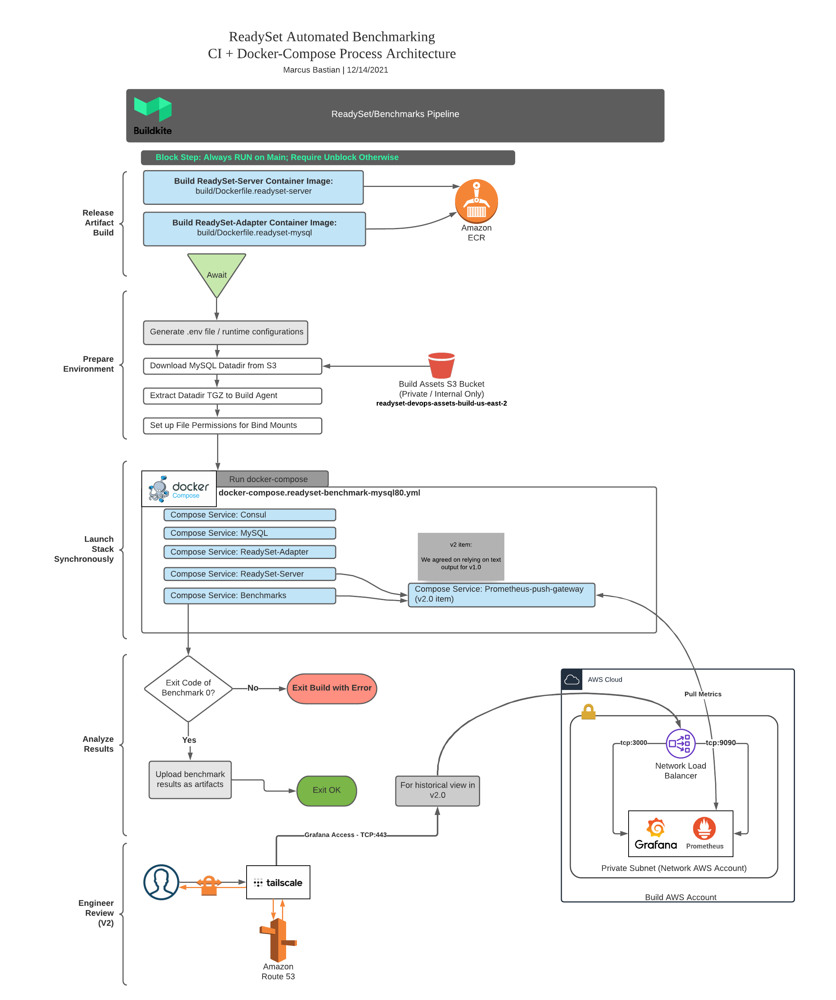
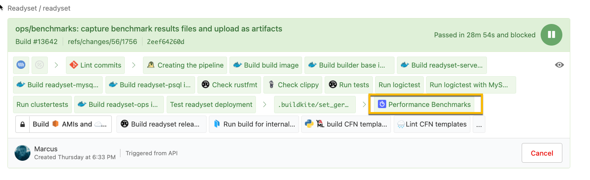
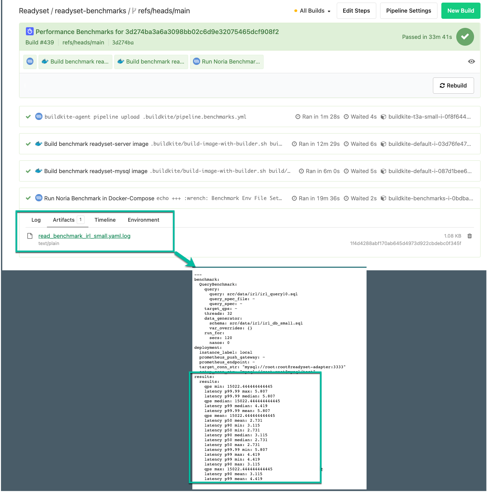

## Benchmarking in CI (Buildkite)

At ReadySet, one way we're choosing to execute our performance benchmarks is by using Docker-Compose in CI, with a pre-built test database filled with a dynamically generated dataset.

The purpose of this document is to give the reader an understanding of what is happening during the benchmarking process, where the results can be found, as well as how one can add new benchmark scenarios to the pipeline. This document won't cover how to write benchmarks, but more-so how written benchmarks can be incorporated into the benchmarking CI pipeline. Additionally, after reading this document, you should have a clear idea of the infrastructure that powers the benchmark runners themselves.

## Table of Contents

1. [Process Automation Overview](#process-automation-overview)
2. [Container Images Involved](#container-images-involved)
3. [When Are Benchmarks Invoked?](#when-are-benchmarks-invoked)
4. [Where Are Benchmarks Invoked?](#where-are-benchmarks-invoked-in-our-pipelines)
5. [Where Are Benchmarks Defined in Code?](#where-are-benchmarks-defined-in-code)
6. [Viewing CI Benchmark Results](#viewing-ci-benchmark-results)
7. [What Infrastructure Are Tests Run On?](#what-infrastructure-are-tests-run-on)
    * [Infrastructure To Know About](#infrastructure-hostnames)

### Process Automation Overview

> A picture is worth a thousand words.



### Container Images Involved

In the above diagram, you may have noticed that this pipeline builds `readyset-server`, `readyset-adapter`, and `benchmarks`.

This is necessary in order for benchmarks to be executed using release binaries, versus those running under debug mode. As you might anticipate, binaries build in debug mode can significantly skew the results of the benchmarks, for the worse. Since customers won't be receiving debug binaries, testing release makes sense.

For the **benchmark runner** container, aka the `benchmarks` service in the `.buildkite/docker-compose.readyset-benchmark-mysql80.yml` file,
here is where you can find the Dockerfile:

`build/Dockerfile.readyset-benchmarks`

**For ReadySet-Server:**

`build/Dockerfile.readyset-server`

**For ReadySet-MySQL (Adapter):**

`build/Dockerfile.readyset-mysql`

### When Are Benchmarks Invoked?

Each time a developer pushes code to the primary ReadySet monorepo, there is an opportunity for the engineer to run the benchmarks. If one clicks into the "Performance Benchmarks" step within their pipeline, they may unblock the execution of the benchmark pipeline.

> **Important Notes:**
>
> - Unblocking the benchmark pipeline is only necessary for feature branch CI runs.
> - For main builds, benchmarks will automatically be executed.

### Where Are Benchmarks Invoked in Our Pipelines?

The primary location where benchmarks are being invoked is in `.buildkite/pipeline.yml` near the end of the pipeline.

Why at the end, one might ask?

We want to be sure that code is otherwise stable and tested before accepting the cost of running benchmarks, since the instance sizes can be quite large.

In the [main pipeline](https://buildkite.com/readyset/readyset), you'll see a `trigger` block step which indicates the pipeline will execute another external pipeline, which in this case is `pipeline.benchmarks.yml`.



The following may be subject to change, but it gives you an idea of what to look for.

```
  - trigger: "readyset-benchmarks"
    label: ":algolia: Performance Benchmarks"
    build:
      branch: ${BUILDKITE_BRANCH}
      commit: ${BUILDKITE_COMMIT}
      message: ":algolia: Performance Benchmarks for ${BUILDKITE_COMMIT}"
    async: true
```

### Where Are Benchmarks Defined in Code?

The CI process detailed in this document builds a benchmarking container image with the yaml files in the following directory:

`benchmarks/src/yaml/benchmarks/test`

These files represent the configurations for the benchmark scenarios, including how many threads to use, what queries to run, what schema should be included as part of setting up the DB, etc.

Here's an example of one of these files:

```
---
QueryBenchmark:
  query:
    query: src/data/irl/irl_query10.sql
    query_spec_file: ~
    query_spec: ~
  target_qps: ~
  threads: 32
  data_generator:
    schema: src/data/irl/irl_db_small.sql
    var_overrides: {}
  run_for:
    secs: 120
    nanos: 0
```

### Viewing CI Benchmark Results

There are now two options for viewing benchmark results:

1) Viewing the results in Grafana, using a metric query similar to the below:

  `benchmark_<metric_name_here>{instance="ci-benchmark-${benchmark_pipeline_build_number}-{commit_sha:0:7}"}`

2) Under the artifacts section of the `:pipeline: Run Noria Benchmark in Docker-Compose` step in the benchmark pipeline, as seen below:



The goal here is to prevent anyone from needing to dive into the build step output, unless they're an operator or find themselves needing to diagnose or debug a pipeline failure. Now that metrics are in the build environment's Prometheus and Grafana infrastructure, this should be even more true today.

### What Infrastructure Are Tests Run On?

Given that benchmarks can consume a significant amount of memory, cpu, and disk I/O, CI benchmarks have an affinity towards their own BuildKite agent queue, which is named `benchmark`.

In terms of Terraform code, the IaC for this queue can be found here:

`./ops/substrate/root-modules/readyset/build/default/us-east-2/buildkite-queues.tf`

As of writing this document, the `benchmark` queue is currently underpinned by Buildkite agents running on the `c5.4xlarge` EC2 instance type, which provides the following resources:

* Compute:
  * 16 vCPUs
* Memory:
  * 32 GiB Memory
* Network Bandwidth:
  *  10 Gbps
* EBS Bandwidth:
  * 4,750 Mbps

#### Infrastructure Hostnames

When metrics are emitted by benchmarks running in CI, the following infrastructure is used to store, scrape, buffer, and visualize the data.

| Name                    | URL                                                | Network Controls    | K8s Namespace |
|-------------------------|----------------------------------------------------|---------------------|---------------|
| Prometheus (Datastore)  | <https://benchmark-prometheus.build.readyset.name> | Internal Only (VPN) | `build`       |
| Prometheus Push Gateway | <https://benchmark-pushgw.build.readyset.name>     | Internal Only (VPN) | `build`       |
| Grafana                 | <https://benchmark-grafana.build.readyset.name>    | Internal Only (VPN) | `build`       |
