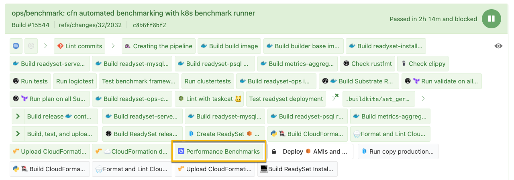

## Benchmarking In CI (Buildkite)

The purpose of this document is to give the reader an understanding of what is happening during the benchmarking process, where the results can be found, as well as how one can add new benchmark scenarios to the pipeline. This document won't cover how to write benchmarks, but more so how written benchmarks can be incorporated into the benchmarking CI pipeline. Additionally, after reading this document, you should have a clear idea of the infrastructure that powers the benchmark runners themselves.

## Table of Contents

1. [Process Automation Overview](#process-automation-overview)
2. [Container Images Involved](#container-images-involved)
3. [Docker-Compose Benchmarking](#docker-compose-benchmarking)
4. [CloudFormation Benchmarking](#cloudformation-benchmarking-with-k8s-runner)
5. [When Are Benchmarks Invoked?](#when-are-benchmarks-invoked)
6. [Where Are Benchmarks Invoked?](#where-are-benchmarks-invoked-in-our-pipelines)
7. [Where Are Benchmarks Defined in Code?](#where-are-benchmarks-defined-in-code)
8. [Viewing CI Benchmark Results](#viewing-ci-benchmark-results)
9. [What Infrastructure Are Tests Run On?](#what-infrastructure-are-tests-run-on)
    * [Infrastructure To Know About](#infrastructure-hostnames)

### Process Automation Overview

Currently at ReadySet, from a high-level, we're executing our product benchmarks in the following ways:

1. On Buildkite agents using Docker-Compose.
2. In AWS, with CloudFormation provisioned ReadySet Stack. Benchmark runners execute in build K8s cluster.

### Container Images Involved

| Image Name         | Purpose | Builds Occur | Dockerfile                             |
|--------------------|--------------------|--------------------|----------------------------------------|
| `305232526136.dkr.ecr.us-east-2.amazonaws.com/readyset-benchmarks` | Benchmark runner | In benchmark pipeline | `build/Dockerfile.readyset-benchmarks` |
| `305232526136.dkr.ecr.us-east-2.amazonaws.com/readyset-server` | Core ReadySet server with rocksDB | In main readyset pipeline | `build/Dockerfile.readyset-server`     |
| `305232526136.dkr.ecr.us-east-2.amazonaws.com/readyset-mysql`| ReadySet MySQL adapter | In main readyset pipeline | `build/Dockerfile.readyset-mysql`    |

### Docker-Compose Benchmarking

To gauge how one might expect docker-compose-based ReadySet environments to perform, we're executing benchmarks in CI using docker-compose. A rather hefty EC2 instance is assigned to the Buildkite queue, which executes this step of the benchmarking pipeline.

For an overview of how it all works, see the diagram below:


### CloudFormation Benchmarking With K8s Runner

Similarly to the docker-compose benchmarks, in this case, we want to benchmark how ReadySet performs when deployed using our ReadySet MySQL CloudFormation template, via in this case `benchmark-super-template.yaml`. This stack deploys an RDS instance using a DB snapshot associated with the DB version, engine, etc. that the benchmarks will be executed against. This snapshot's source DB instance was populated using the data generator.

In contrast to the docker-compose setup, this process runs the benchmark binary in Kubernetes, not on the build agent directly. The benchmark runner is implemented in the form of a K8s job, which is templatized and deployed into the build Kubernetes cluster using [Helm](https://helm.sh/docs/). The chart for the job can be found here:

`benchmarks/provisioning/helm/charts/readyset-benchmarks/`

As demand for benchmark runner capacity increases, `cluster-autoscaler` will dynamically scale the fleet of EC2 instances in our autoscaling group. If there's not enough capacity, new nodes will be added on-demand to execute a benchmark.

For an overview of how it all works, see the diagram below:


### When Are Benchmarks Invoked?

Each time a developer pushes code to the primary ReadySet monorepo, there is an opportunity for the engineer to run the benchmarks. If one clicks into the "Performance Benchmarks" step within their pipeline, they may unblock the execution of the benchmark pipeline.

> **Important Notes:**
>
> - Unblocking the benchmark pipeline is only necessary for feature branch CI runs.
> - For main builds, benchmarks will automatically be executed.

### Where Are Benchmarks Invoked in Our Pipelines?

The primary location where benchmarks are being invoked is in `.buildkite/pipeline.yml` near the end of the pipeline.

Why at the end, one might ask?

We want to be sure that code is otherwise stable and tested before accepting the cost of running benchmarks, since the instance sizes can be quite large.

In the [main pipeline](https://buildkite.com/readyset/readyset), you'll see a `trigger` block step which indicates the pipeline will execute another external pipeline, which in this case is `pipeline.benchmarks.yml`.



The following may be subject to change, but it gives you an idea of what to look for.

```
  - trigger: "readyset-benchmarks"
    label: ":algolia: Performance Benchmarks"
    build:
      branch: ${BUILDKITE_BRANCH}
      commit: ${BUILDKITE_COMMIT}
      message: ":algolia: Performance Benchmarks for ${BUILDKITE_COMMIT}"
    async: true
```

### Where Are Benchmarks Defined in Code?

The CI process detailed in this document builds a benchmarking container image with the yaml files in the following directory:

`benchmarks/src/yaml/benchmarks/test`

These files represent the configurations for the benchmark scenarios, including how many threads to use, what queries to run, what schema should be included as part of setting up the DB, etc.

Here's an example of one of these files:

```
---
QueryBenchmark:
  query:
    query: src/data/irl/irl_query10.sql
    query_spec_file: ~
    query_spec: ~
  target_qps: ~
  threads: 32
  data_generator:
    schema: src/data/irl/irl_db_small.sql
    var_overrides: {}
  run_for:
    secs: 120
    nanos: 0
```

### Viewing CI Benchmark Results

There are now two options for viewing benchmark results:

1) Viewing the results in Grafana, using a metric query similar to the below:

  `benchmark_<metric_name_here>{instance="ci-benchmark-${benchmark_pipeline_build_number}-{commit_sha:0:7}"}`

2) Under the artifacts section of the `:pipeline: Run ReadySet Benchmark in Docker-Compose` or the `:algolia: Launching benchmark job in :k8s:` step in the benchmark pipeline, as seen below:


The goal here is to prevent anyone from needing to dive into the build step output, unless they're an operator or find themselves needing to diagnose or debug a pipeline failure. Now that metrics are in the build environment's Prometheus and Grafana infrastructure, this should be even more true today.

### What Infrastructure Are Tests Run On?

Given that benchmarks can consume a significant amount of memory, cpu, and disk I/O, CI benchmarks have an affinity towards their own BuildKite agent queue, which is named `benchmark`.

In terms of Terraform code, the IaC for this queue can be found here:

`./ops/substrate/root-modules/readyset/build/default/us-east-2/buildkite-queues.tf`

As of writing this document, the `benchmark` queue is currently underpinned by Buildkite agents running on the `c5.4xlarge` EC2 instance type, which provides the following resources:

* Compute:
  * 16 vCPUs
* Memory:
  * 32 GiB Memory
* Network Bandwidth:
  *  10 Gbps
* EBS Bandwidth:
  * 4,750 Mbps

#### Infrastructure Hostnames

When metrics are emitted by benchmarks running in CI, the following infrastructure is used to store, scrape, buffer, and visualize the data.

| Name                    | URL                                                | Network Controls    | K8s Namespace |
|-------------------------|----------------------------------------------------|---------------------|---------------|
| Prometheus (Datastore)  | <https://benchmark-prometheus.build.readyset.name> | Internal Only (VPN) | `build`       |
| Prometheus Push Gateway | <https://benchmark-pushgw.build.readyset.name>     | Internal Only (VPN) | `build`       |
| Grafana                 | <https://benchmark-grafana.build.readyset.name>    | Internal Only (VPN) | `build`       |
