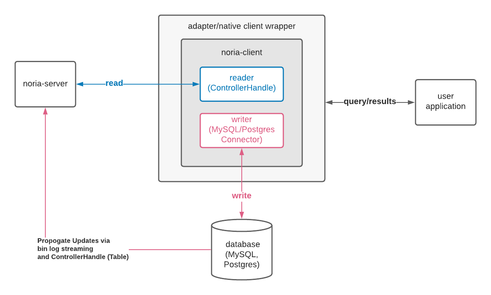
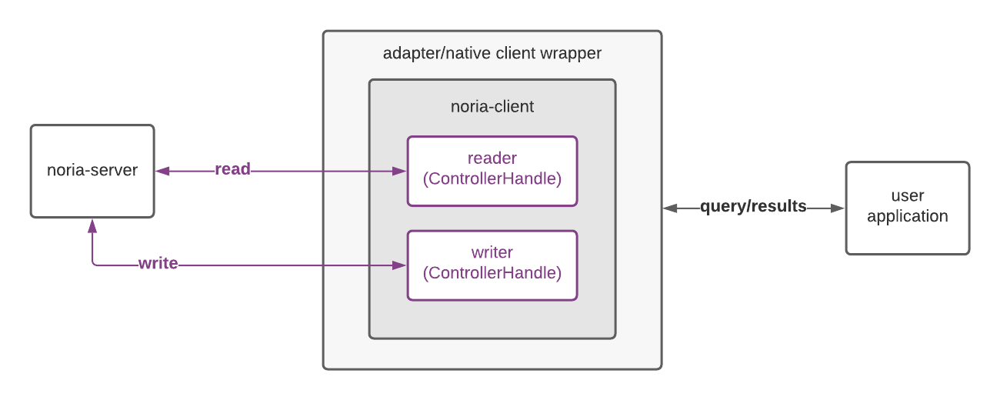

# Clients and Connecting

For a user application to interface with ReadySet, it either uses the native ReadySet client (if implemented for the application's language - currently only available for Node.js and Rust) or it uses an existing 3rd-party MySQL client library connected to the ReadySet MySQL adapter.

Either way, the native ReadySet client and the MySQL adapter both act as wrappers for the [`noria-client`](./noria_client.md). The [`noria-client`](./noria_client.md) is intended to be the fundamental backbone that all user-facing clients can wrap.

When a user application makes a query using the [`noria-client`](./noria_client.md) (or one of the wrapped versions of the [`noria-client`](./noria_client.md)) the [`noria-client`](./noria_client.md)'s internal reader or writer carries out the process of interacting with the [noria server](server.md) or an underlying external database. The diagram below shows the basic wiring of a user application, a (probably wrapped) [`noria-client`](./noria_client.md), the [noria server](server.md), and an external underlying database such as MySQL.

The additional diagram below shows the basic wiring of the system when there is no underlying database present and the [`noria-client`](./noria_client.md) is configured to send writes directly to the [noria server](server.md).

