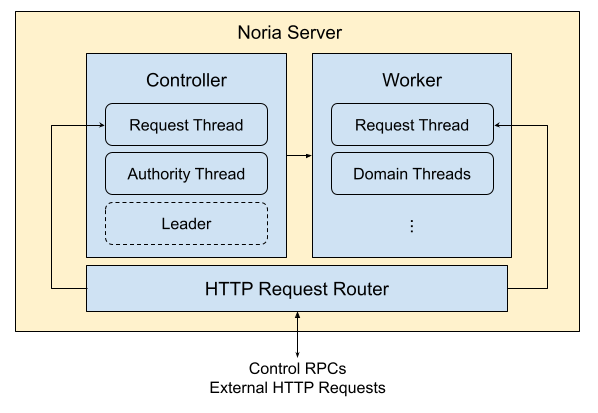
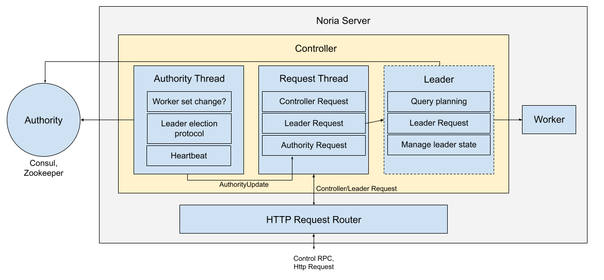

# Noria Server
Updated 9-29-2021, justin@

Noria servers are the process that implement the core dataflow engine. Each server can be separated into the `Controller`, which handles control plane logic [^1], the `Worker` which handles data plane logic [^2], and the `NoriaServerHttpRouter` which handles and routes http requests to the `Controller` and `Worker`.

<b>Figure: Overview of the noria-server components</b>

The noria-server is comprised of tasks executing on a multi-threaded [tokio](https://docs.rs/tokio/1.12.0/tokio/) runtime. Each component, the `Worker`, `Controller`, and `NoriaServerHttpRouter` is spawned as a task which in turn may spawn tasks to handle their operations.

[^1]: **Control plane logic** handles how the system works and implements logic to handle fault tolerance, availability, leader election, query planning. 

[^2]: **Data plane logic** runs components of the dataflow graph such as performing dataflow node operations (e.g. join, aggregate, project).

## Controller

The controller is responsible for all control plane logic for a single noria-server. It has three primary responsibilities broken into their own tasks in the runtime: 
1. **Authority Thread:** Observe changes in the Authority, the entity responsible for cluster management and leader election. 
2. **Request Thread** Handle control messages for this noria-server such as starting new domains, replicating existing domains.
3. **Leader:** If applicable, act as the leader in the system and process all leader-related controller requests: query planning, worker failures, worker registration.

<b>Figure: Overview of the noria-server components</b>

### Authority Thread
The authority thread is responsible for participating in the leader election protocol, communicating liveness of the server with the authority cluster, and observing
authority state changes in the cluster that correspond to worker failures, worker registration, and leadership changes. The communication with the authority cluster
is facilitated by the `Authority`, which acts as a client to various authority clusters.

The authority thread maintains two types of local state that mirror the authority cluster state: **(1) leader election state**, `AuthorityLeaderElectionState`, 
who is the current leader in the system, and **(2) worker state**, `AuthorityWorkerState`, what is the state of the current set of workers in the system. 
At a high-level the authority thread operates by continuously reconciling differences between these states, and the state in the cluster.

___
*Example: Worker failure detection*

If a worker is in the `AuthorityWorkerState` but not in the authority cluster's worker state then the worker has been detected as failed by the authority cluster.
We reconcile this by removing the worker from our local state and sending a `WorkerFailed` message to our controller.
___

  
Authority thread operations

 
  1. Detect leader failure -> Initiate leader election protocol.
  2. Attempt to become the leader -> Become leader or detect a new leader is elected.
  3. Detect new leader elected -> Inform worker of new leader.
  4. Worker registered with authority -> If leader, handle worker registration.
  5. Worker detected failed by authority -> If leader, handle worker failed.
  6. Issue heartbeat to authority cluster -> If informed that we are detected as failed, kill server.

  Each of these operations is accompanied by sending an `AuthorityUpdate` message to the controller, such as
  `AuthorityUpdate::LeaderFailed`, `AuthorityUpdate::NewWorker` 

### Request thread
The request thread handles controller requests destined for the leader and authortity updates from the Authority thread.
If the controller is currently acting as the leader of the system, it handles controller requests and authority updates
that apply to leaders such as: `AuthorityUpdate::NewWorker`, or `/install_recipe` requests to update the dataflow graph.

  
 Request thread operations

  
  The request thread handles all `AuthorityUpdate` messages from the Authority thread. Whenever the leader is changed,
  a message is sent to the `Worker` associated with the controller. Worker state changes are only handled when the
  controller is the leader as they can result in dataflow graph changes.

  `ControllerRequest` messages are sent to the controller when it is the leader. This can be anything from querying
  for leader state, to making changes to the dataflow graph. This logic can be found in `Controller::handle_controller_request()`.

### Leader
The leader handles worker state changes, worker failures and registrations, and any external requests to the leader.
These external requests can be migrations, requesting handles to workers in the form of `Table` and `View`, control
plane requests such as replication requests, or general queries for controller information [^3]. 
A controller only has a Leader if it is currently elected the leader of the system. Below we detail important
leader operations:

  
Migrations

  Migrations occur at the leader when a change to the dataflow graph is required. This can happen when: 
   1. A worker has failed or registered,
   2. A reader node is requested to be replicated on a new server
   3. A user wants to add or remove a view for a query
   4. The databases has changed and we receive DDL of the change.

   When the dataflow graph changes, a new recipe is applied to the system. We defer the discussion of how query
   planning and assignment of nodes to domains works to other sections of the docs. Migrations occur in two
   steps: Migration planning begins by generating a <code>MigrationPlan</code>, doing so verifys that we can generate a
   dataflow graph for the new recipe, and a set of operations to perform to convert our existing data flow graph
   to the new graph. If all goes well, we apply the <code>MigrationPlan</code> to the dataflow graph.

   Applying the `MigrationPlan` entails sending messages to start and kill domains on the workers in the system.
   Then dataflow nodes are constructed in these domains through the use of `DomainRequest` messages. Finally
   if the migration succeeds, the leader updates the state in the authority cluster.

  
 <code>Table</code> and <code>View</code>

  The noria client performs many operations through the use of <code>Table</code> and <code>View</code> handles. A <code>Table</code>
  is a handle used by clients to perform writes, deletes, and other table operations to noria base tables. A <code>View</code> is
  a handle used to read data from a specific reader replica in noria.

  <i>How does leader facilitate construction of these objects?</i>
  
  The noria clients have no knowledge of the inner workings of the deployment and the dataflow graph, however the controller does.
  When requesting a <code>View</code> or <code>Table</code> object, the noria client requests a <code>TableBuilder</code> or 
  <code>ViewBuilder</code> from the <code>/table_builder</code> or <code>/view_builder</code> endpoints, respectively. 
  These provide the noria client with all the information required to create a connection directly with the server that has
  the base table or replica, the <code>View</code> and <code>Table</code> objects. 

[^3]: The controller supports many http endpoints for state such as `/nodes`, `/workers`, `/graphviz`. The complete list can
be found in `external_request` in `controller/inner.rs`.

  
<b style="font-size:120%">Useful code entry points</b>

   Note: This is likely to change frequently and may be out of date 

  * `controller.rs`: Definitions of the `Worker` and `Controller` objects.
    * `Controller::run()`: Run loop for the requests thread.
    * `authority_inner()`: Run loop for the authority thread, started in `Controller::run()`

  * `startup.rs`: Construction of `Controller` objects and controller thread spawn.

   

## Worker (TODO)

## HTTP Request Router
The HTTP request router is a `hyper` server running a tower service that listens for HTTP requests on a TCP socket. It handles basic requests
that do not require communication with the `Worker` or `Controller` such as process-level metrics `/metrics_dump`,
`/prometheus`.

For requests on the worker endpoint, `/worker_request`, it converts the body of the message to a `WorkerRequest` and routes it to the
`Worker`.

Any request that is not handled is converted to a `ControllerRequest`, a wrapper for an HTTP request, and sent to the controller.

  
<b style="font-size:120%">Useful code entry points</b>

   Note: This is likely to change frequently and may be out of date 

  * `http_router.rs`: The implementation of the http router object, initialized in `startup.rs`.

