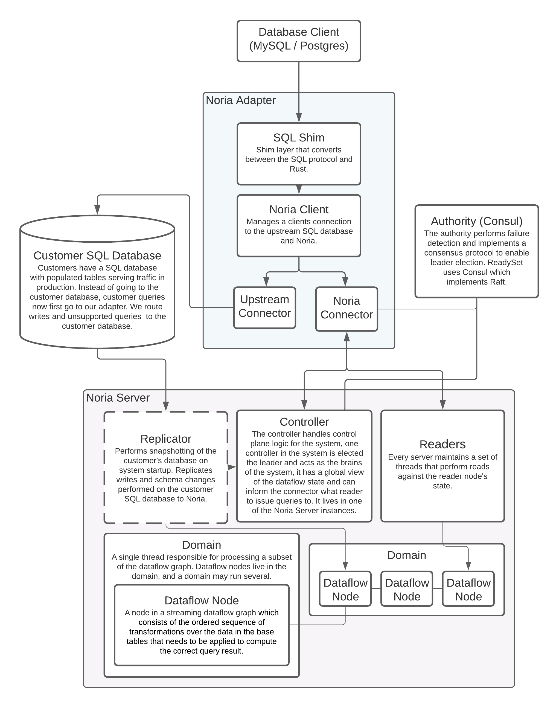

# System Components
 Updated: 1-7-16, justin@ 

ReadySet's architecture is broken into two main components:
  1. **The Noria Adapter**: A server that implements the MySQL or PostgreSQL protocol and proxies requests to the customer database and
     noria.

     > <b>Why might we proxy a query to one of upstream or noria?</b>
     >
     > ReadySet does not support every SQL query (yet), some SQL queries may perform worse on ReadySet, i.e. `SELECT * FROM t1`.
     > Writes and schema changes are handled by the customer database and propagated to our system through the Replicator, see noria server for
     > more information.

  2. **The Noria Server**: The server that is comprised of three components:
       * **Controller**: Responsible for handling Noria control plane logic, one server in the Noria cluster will be elected the **Leader** and
         initiate all control plane logic such as migrations.

       * **Worker**: Responsible for the Noria data plane. Read queries are issued against `Readers` in the worker, while the rest of the dataflow
                     graph lives in worker domains.

       * **Replicator**: The server that is elected the leader will have a replicator. The replicator initially bootstraps our system with data via
                         snapshotting the customer database. It then replicates writes and schema changes from the customer database.

<b>Figure: ReadySet system architecture</b>

### Noria Adapter

The noria adapter, often referred to as the **adapter**, allows us to seamlessly execute queries
against a customer database (postgres or mysql) and against a noria cluster. It accomplishes this by creating an
upstream connector and a noria connector per adapter connection, each being used to proxy queries to their
respective database. The adapter binaries are in `noria-mysql` and `noria-psql`, but the majority of the code
is in `//noria-client/src/backend.rs`.

The interface between the adapter and the noria-server is the **Noria Connector**. The noria connector component performs
operations against Noria using the noria client bindings: `//noria/noria`. It
roughly maps SQL operations: `prepare`, `execute`, `query`, to the Noria API. It performs additional per-connection
book-keeping to do cache connections to tables and views.

### Noria Server
Within a cluster, noria-server's primary responsibility is to implement the core dataflow engine that receives
statements from the Noria client and constructs and operates dataflow representations of these queries. There can be
many servers that comprise a noria cluster, each owning a subset of the dataflow graph. The server is responsbile for
both control-plane operations via the controller (`//noria/server/src/controller`), and data-plane operations (running
components of the dataflow graph) via the worker (`//noria/server/src/worker/`).

### Authority
Each noria server instance regularly communicates with a cluster management **authority**. The authority is essentially
a distributed key-value store used to perform sychronization. We implement wrappers around the authority to enable
failure detection and leader election. In production we use [Consul](https://www.consul.io/), but also have a
[Zookeeper](https://zookeeper.apache.org/) authority wrapper as well.
