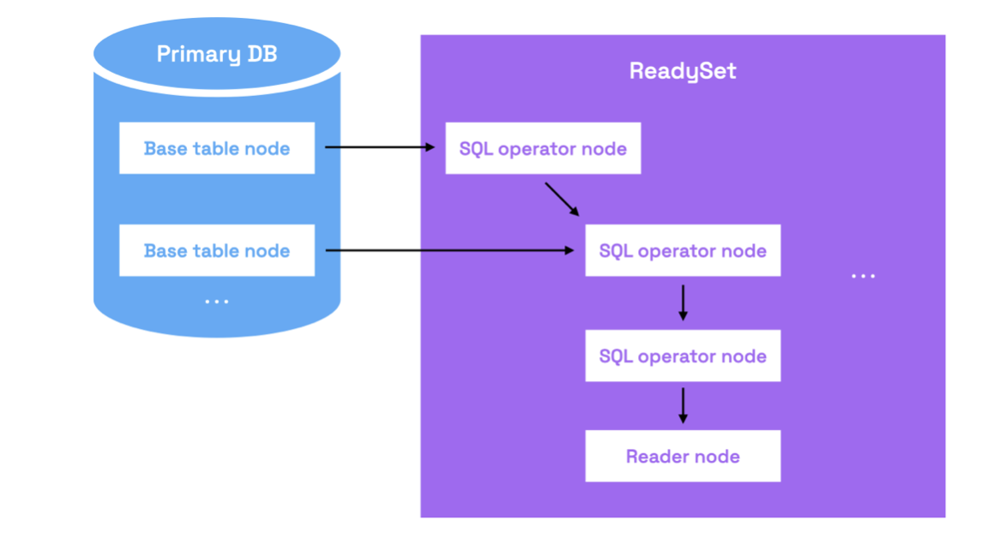
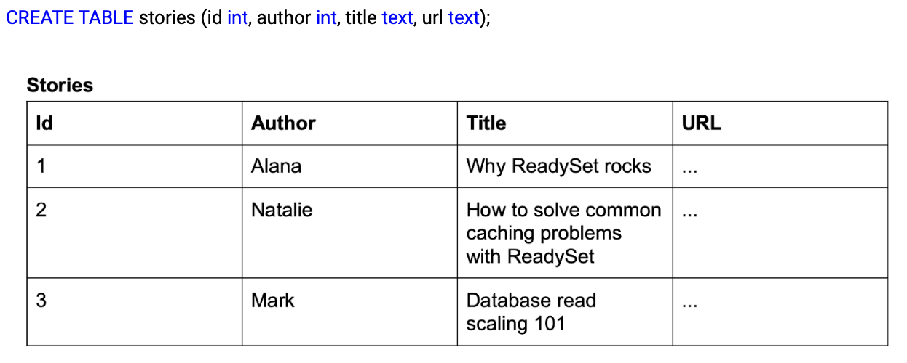
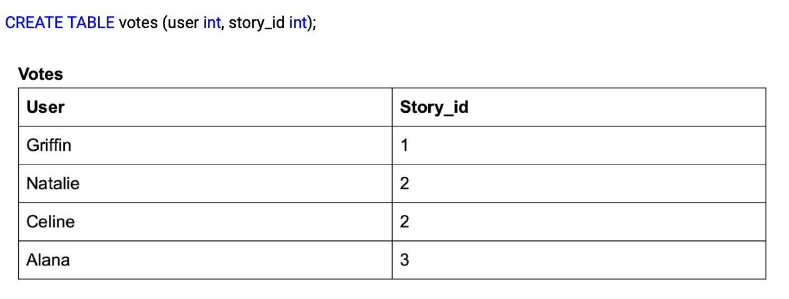
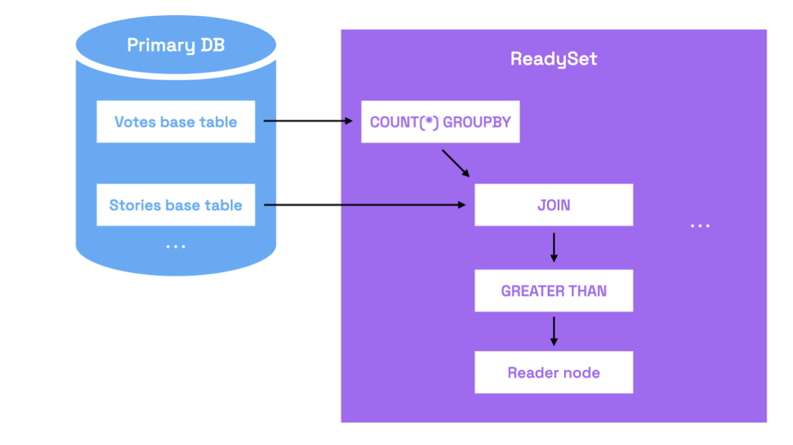
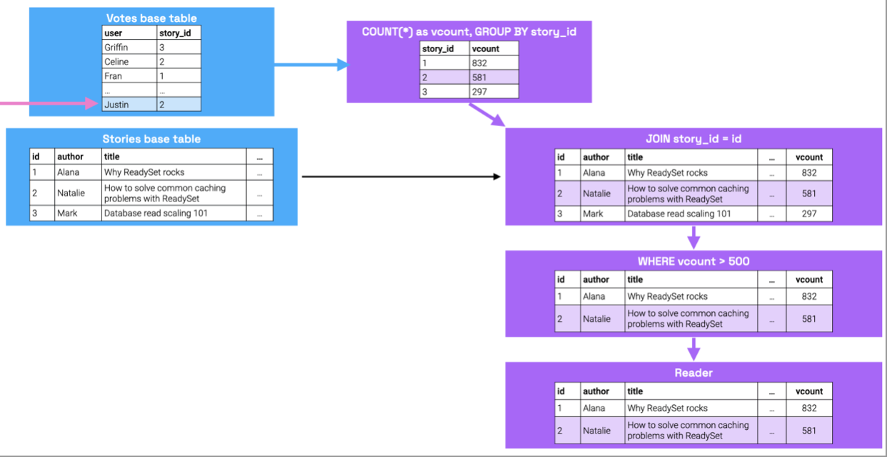
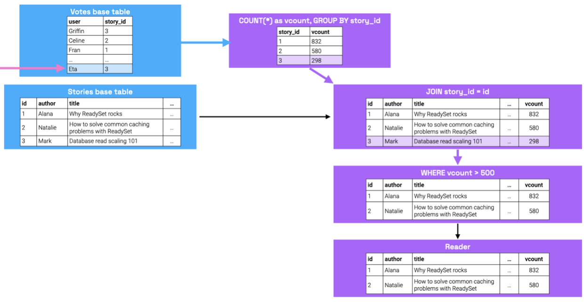

# Product Background 

ReadySet is a caching middleware layer that provides incrementally maintained materialized views for a known set of queries (specified as prepared statements). 
These views can improve application performance drastically, as all computation is performed at write-time, and reads are equivalent to cache reads.
ReadySet plugs directly into existing databases and applications without any code changes through the MySQL and Postgres adapters. 


## Interacting with ReadySet

There are two different strategies for reading from ReadySet, and ReadySet can be incrementally adopted for a subset of an application’s queries.  
- Plug-and-play approach: ReadySet provides database adapters that enable users to perform reads through the MySQL and Postgres binary protocols and continue to use standard ORMs and database client libraries without any code changes.
- Fully-integrated approach: Although the plug-and-play approach covers the vast majority of use cases, ReadySet offers both a Rust and Javascript client library that provides additional features, such as support for read-your-writes consistency. The client library APIs are modeled after standard MySQL/Postgres client libraries, so switching to use them often requires minimal code changes. 

## Example Usage 

Given a prepared statement (also known as a parameterized query), ReadySet automatically caches the results for that query and incrementally updates them as writes get applied to the underlying database. To illustrate how ReadySet accomplishes this, we’ll first explore its internals and then walk through the write and read processes. We will also step through a simple example of these concepts that is inspired by loading the front page of a news site.  

### Dataflow engine 

The heart of ReadySet is the dataflow engine. Given a prepared statement, the dataflow engine compiles that query into a dataflow graph that is responsible for executing that query. 

The roots of the graph are nodes that represent the application base tables (“base table nodes”). ReadySet monitors the primary database’s binlogs (log files that contain information about data modifications made as the result of users issuing inserts/updates/deletes) and replicates these data changes (“deltas”) to the base table nodes. The base table nodes serve as an entry point to the overall dataflow graph: once deltas enter the base tables nodes, they then propagate down through any outgoing edges connected to these nodes, passing through other children nodes until they finally hit the leaf nodes of the graph.

There are two other node types in the graph: internal nodes and reader nodes. Internal nodes are associated with SQL operators (i.e. functions from relational algebra like joins, aggregates, projections, and filters). They each compute their associated function on incoming deltas, and maintain internal state representing the results of their function. Whenever their internal state changes (e.g. whenever they receive new deltas that cause their function output to change), these nodes emit new deltas that represent these changes, and send them down outgoing edges to any children nodes. 



Queries can be decomposed into constituent SQL operations, and internal nodes are chained together in a way that represents this query. The resulting dataflow graphs look similar to traditional database query plans, but since they are materialized in memory, they are optimized in a different way. The leaf nodes of the graph, referred to as reader nodes, cache the final query results. Reader nodes can be replicated on arbitrary machines in the same region or in different ones.

As writes occur, the resulting data changes are immediately replicated to ReadySet. ReadySet incrementally updates the cached query results to reflect these changes. This automatic cache result repair mechanism obviates the need for writing custom cache eviction logic. 

### Example: Hacker News 


#### Query 

Now, we will walk through setting up ReadySet for a simple news forum application. To store story and vote information, we define a database with the following DDL: 




Let’s say you have a query that returns popular stories, which are categorized as having more than 500 votes. To load the content on the front page of our forum application, a developer might use the following prepared statement, which we’ll call the `StoresWithVoteCount` query: 


```
SELECT id, author, title, url, vcount
FROM stories
JOIN (SELECT story_id, COUNT(*) AS vcount 
			FROM votes GROUP BY story_id) 
AS VoteCount
ON VoteCount.story_id = stories.id WHERE stories.id = ? AND WHERE VoteCount.vcount > ?;
```

Let’s break this query down further: per Figure 5, the VoteCount subquery counts all of the votes associated with each story, and returns them along with the story ID. From there, we join the VoteCount results with the stories table on story ID to combine all of the raw info about the story with its computed vote count. The results of the JOIN node then pass through the > 500 filter on vcount. To then get the result of this query for a given story ID 4, you would instantiate it and replace the `?` parameter with `4`. We will refer to this parameter as the key. 

#### Running the query in ReadySet 

Traditional databases would compute the results of this query from scratch every time it was issued. ReadySet takes a different approach and instead precomputes and incrementally maintains the results of this query for commonly read keys. 

To accomplish this, ReadySet creates a dataflow graph, as described in the previous section. Under the hood, the data flow graph would look as follows: 



Now, let’s consider when the data changes. Let’s say that we add a record to the Votes table to reflect the fact that Justin voted for story with ID 2. This update would first be applied to the Votes base table at the root of the graph, and then be propagated through the graph, updating all children nodes along that way. 



The leaf nodes of the query graph (referred to as Readers in the figures) cache the final query results. When users issue queries, the queries are routed directly to these reader nodes. Under the hood, these nodes are represented by special data structures that are optimized for low latency access and to support many users accessing it once.

Consider the following instantiated version of the StoriesWithVoteCount query (where the ? parameter is filled in with value 2): 


The reader node stores a mapping from story IDs to query results, and thus this read in ReadySet can be decomposed into performing a single key-value lookup for key 2 into this node.

ReadySet’s streaming dataflow model ensures that the cache state is kept up-to-date every time the data changes without requiring any developer effort or rerunning the query from scratch. ReadySet entirely obviates the need for writing any custom cache maintenance logic. 

There may also be cases where a new write does not change the stored result of a Reader node. Instead of the previous write, let’s say Eta voted for story with ID 3. Per Figure 8, when the data flows to the WHERE vcount > 500 node, the results don’t change, so downward propagation halts. ReadySet may reuse nodes for multiple queries when constructing the dataflow graph for your application, so the results of every node are kept fresh with each write even if the Reader node remains unchanged.


